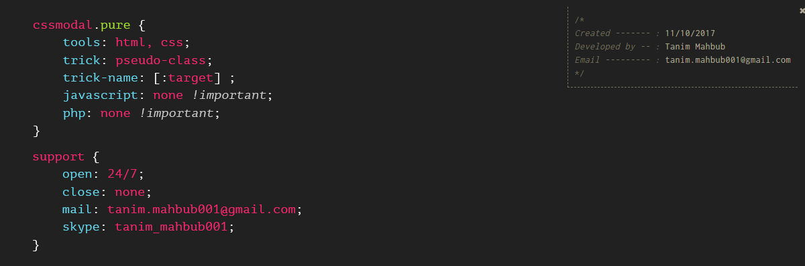

[](https://tanimmahbub.github.io/css_modal/)
# PURE CSS MODAL

This was an experiment for CSS :target Selector when it was introduced for the very first time. So goal was to make a working modal without any js. Check out the [live demo](https://tanimmahbub.github.io/css_modal/).

## Basic Markup

```html
<div class="cssmodal-container" id="cssmodal">
  <div class="cssmodal-screen">
    <a href="#close" class="overlay"></a>
    <div class="css-modal">
      <a href="#close" class="exit-button"><i class="fa fa-close"></i></a>
      <p>Lorem ipsum dolor sit amet, consectetur adipisicing elit. Beatae tempora in sequi perferendis accusamus soluta aut nobis laborum, quia quod, nisi perspiciatis nemo</p><br><br>
      <a href="#close" class="cssmodal-btn">Close modal</a>
    </div>
  </div>
</div>
```


| **Modal Class Names** | **Description** |
| :-------------------- | --- |
|  `.cssmodal-container`   | class is the parent container, also contains the `id` for the `:target` and the black overlay. |
| `.cssmodal-screen` | is the second parent with `position: fixed;` and `overflow-y: auto;` |
| `.overlay` | for closing the modal when the outer side (the black overlay area) is clicked |
| `.css-modal` | is the class for default modal **size** and **position**. There are 2 more sizes - `.cssmodal-sm` and `.cssmodal-lg` if you want to change the size, add the size-class you want with `.css-modal`. | 

### Small Modal Markup
```html
<div class="cssmodal-container" id="cssmodal-2">
  <div class="cssmodal-screen">
    <a href="#close" class="overlay"></a>
    <div class="css-modal cssmodal-sm">
      <a href="#close" class="exit-button"><i class="fa fa-close"></i></a>
      <p>Lorem ipsum dolor sit amet, consectetur adipisicing elit. Beatae tempora in sequi perferendis accusamus soluta aut nobis laborum, quia quod, nisi perspiciatis nemo</p><br><br>
      <a href="#close" class="cssmodal-btn">Close modal</a>
    </div>
   </div>
</div>
```

But if you want to change the position, then you have to ==**replace**== the `.css-modal` class with the *position-class* you want. There are 4 more position-classes: 

| **Position Class Names** | **Positions** |
| ---- | ---- |
|`.cssmodal-tl`| for position `top: 0` & `left: 0` |
|`.cssmodal-tr`| for position `top: 0` & `right: 0` |
|`.cssmodal-bl`| for position `bottom: 0` & `left: 0` |
|`.cssmodal-br`| for position `bottom: 0` & `right: 0` |

### Small Modal Markup for topLeft position
```html
<div class="cssmodal-container" id="cssmodal-5">
  <div class="cssmodal-screen">
    <a href="#close" class="overlay"></a>
    <div class="cssmodal-tl cssmodal-sm">
      <a href="#close" class="exit-button"><i class="fa fa-close"></i></a>
      <p>Lorem ipsum dolor sit amet, consectetur adipisicing elit. Beatae tempora in sequi perferendis accusamus soluta aut nobis laborum, quia quod, nisi perspiciatis nemo</p><br><br>
      <a href="#close" class="cssmodal-btn">Close modal</a>
    </div>
  </div>
</div>
```

You see the `href="#close"` in-

```html
<a href="#close" class="overlay"></a> 
<!-- and -->
<a href="#close" class="cssmodal-btn">Close modal</a> 
```

but there is no `id` by that name (`#close`). The reason for that is, if you close the modal with just `#` like this `href="#"` then it will take you to the top of the page no matter where you are in the browser. So, if you close the modal this way (`href="#close"` without any `id` by that name) then your position in the browser will not change.


This is an experiment, let's see where it goes.
